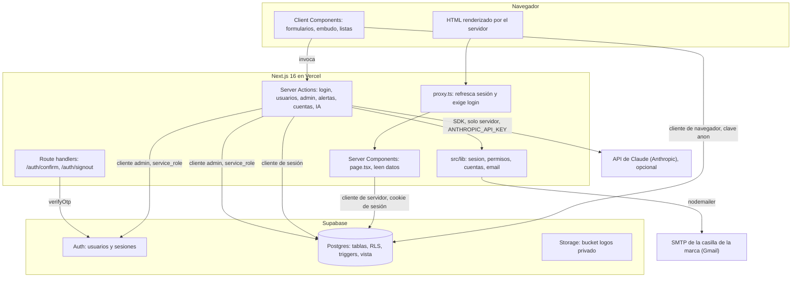
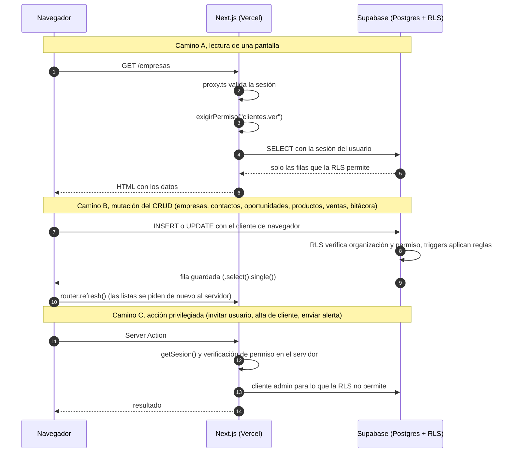
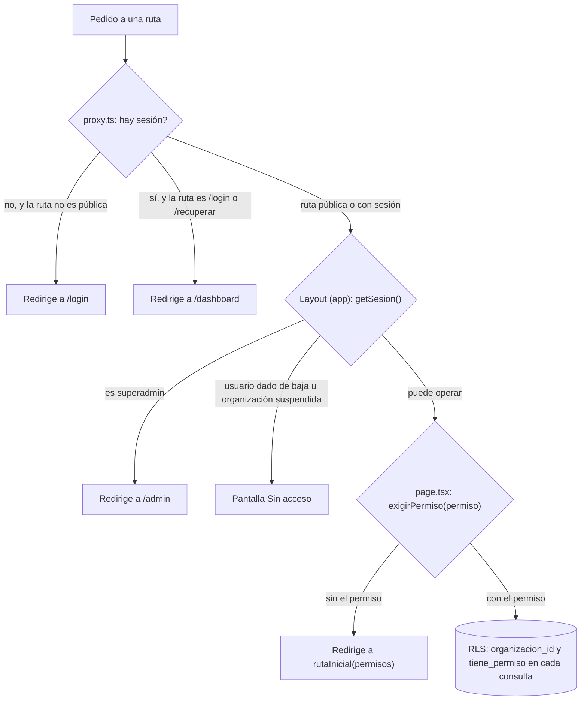
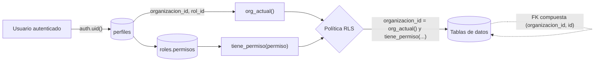
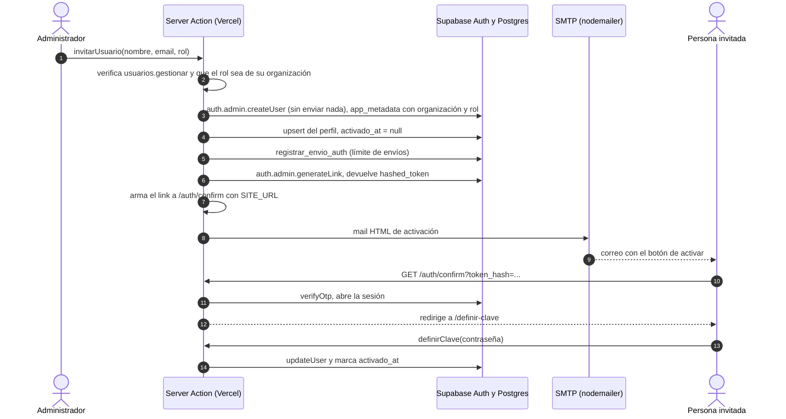
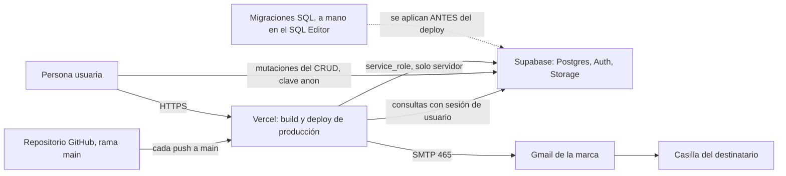

# Arquitectura

Cómo está armado Tuco & Nito y por qué. Los diagramas usan Mermaid y se ven directamente en GitHub.

**En una frase.** Una aplicación Next.js 16 (App Router) en Vercel que lee y escribe en un Postgres de
Supabase, donde la seguridad y las reglas de negocio viven en la base (RLS y triggers) y no en el código de
la aplicación.

Contenido: [1. Componentes y capas](#1-componentes-y-capas) · [2. Flujo de un pedido](#2-flujo-de-un-pedido) ·
[2.1 Listas paginadas en el servidor](#21-listas-paginadas-en-el-servidor-la-url-es-el-estado-f3) ·
[2.2 Búsqueda global](#22-búsqueda-global-ctrlk-f5) ·
[2.3 IA asistida](#23-ia-asistida-f7-una-server-action-por-el-secreto) ·
[3. Sesión y protección de rutas](#3-sesión-y-protección-de-rutas) · [4. Multitenencia](#4-multitenencia) ·
[5. Flujo de mails](#5-flujo-de-mails) · [6. Topología de despliegue](#6-topología-de-despliegue)

---

## 1. Componentes y capas



| Capa | Dónde vive | Responsabilidad |
|---|---|---|
| Presentación | `src/app/**/page.tsx` (servidor) y `*View.tsx`, `*Form.tsx`, `*List.tsx` (cliente) | Pintar, pedir datos, esconder lo que el rol no puede usar |
| Componentes compartidos | `src/components/` y `src/components/ui/` | Sumar UI Kit (primitivas), formularios, `Drawer`, `AppShell`, íconos del rubro |
| Sesión y permisos | `src/lib/sesion.ts`, `src/lib/permisos.ts`, `src/proxy.ts` | Quién es el usuario, qué permisos tiene, guardas de página |
| Cuentas y mails | `src/lib/cuentas.ts`, `src/lib/email/` | Alta, activación, recuperación; único punto de salida de mails |
| Acceso a datos | `src/lib/supabase/` (`client.ts`, `server.ts`, `admin.ts`, `middleware.ts`) | Tres clientes de Supabase, uno por contexto |
| Seguridad y reglas | `supabase/migrations/` | RLS por organización y permiso, triggers, funciones, claves foráneas compuestas |

**Los tres clientes de Supabase.**

| Cliente | Archivo | Clave | Dónde corre | Pasa por RLS |
|---|---|---|---|---|
| Navegador | `client.ts` | anon (pública) | Client Components | Sí |
| Servidor con sesión | `server.ts` | anon + cookie de sesión | Server Components, Server Actions, route handlers | Sí |
| Administración | `admin.ts` | `service_role` | Solo servidor (`import "server-only"`) | **No**: saltea todo |

El cliente de administración se usa únicamente después de verificar en el servidor que quien pide tiene
permiso, y solo para lo que la RLS no permite a propósito (crear usuarios de Auth, modificar `perfiles`,
generar links de acceso).

---

## 2. Flujo de un pedido

Hay tres caminos. La regla: **lecturas desde el servidor, escrituras del CRUD desde el navegador, y Server
Actions solo para lo privilegiado.**



**Por qué las mutaciones del CRUD van desde el navegador y no por Server Actions.** La interfaz edita en
paneles laterales sin navegar. Después de una Server Action, `router.refresh()` a veces dejaba la lista
mostrando el estado viejo hasta recargar a mano. La solución fue escribir desde el cliente de Supabase,
pedir la fila guardada y mezclarla en el estado de React. La RLS protege igual que si fuera del lado del
servidor. Detalle en la [decisión 0001](./decisiones/0001-mutaciones-desde-el-cliente.md).

**Qué sí es Server Action y por qué.** Todo lo que necesita secretos o escribir cookies:

| Archivo | Acciones | Motivo |
|---|---|---|
| `src/app/login/actions.ts` | `login` | Escribe la cookie de sesión; reenvía la activación a cuentas pendientes |
| `src/app/recuperar/actions.ts` | `recuperar` | Dispara el mail de recuperación con la clave de servicio |
| `src/app/definir-clave/actions.ts` | `definirClave` | Cambia la contraseña y marca `activado_at` |
| `src/app/(app)/usuarios/actions.ts` | `invitarUsuario`, `cambiarRol`, `cambiarActivo`, `reenviarInvitacion`, `guardarRol`, `borrarRol` | Los `perfiles` no tienen política de escritura: solo el servidor los toca |
| `src/app/admin/actions.ts` | `crearCliente`, `agregarAdministrador`, `cambiarEstadoCliente`, `reenviarInvitacionAdmin` | Operaciones de plataforma |
| `src/app/(app)/alertas/actions.ts` | `enviarAlertaEmail`, `registrarEnvioWhatsapp` | Envía por SMTP; deriva destinatario y texto de la base, no del navegador |
| `src/app/(app)/alertas/actions.ts` | `registrarEnvioConBorrador` (F7) | Solo REGISTRA un aviso que la persona mandó desde su WhatsApp o su correo con el borrador de la IA; no envía nada |
| `src/app/(app)/ia/actions.ts` | `redactarAvisoRecambio`, `resumirCuenta` (F7) | **Excepción a propósito** (ver 2.3): llamar a Claude exige `ANTHROPIC_API_KEY`, un secreto que no puede llegar al navegador |
| `src/app/(app)/buscar/actions.ts` | `buscarGlobal` | **Excepción a propósito** (ver 2.2): no usa secretos; consulta con la sesión de la persona y resuelve la búsqueda global en una sola ida |

Cada Server Action empieza verificando la sesión y el permiso y valida el tipo y la forma de sus
argumentos, porque llegan del navegador y pueden ser cualquier cosa.

### 2.1 Listas paginadas en el servidor: la URL es el estado (F3)

Desde F3 las seis listas (`/empresas`, `/contactos`, `/oportunidades` en vista Lista, `/productos`,
`/ventas` y `/usuarios`) **no cargan todo y filtran en el navegador**: cada pantalla pide al servidor
solo la página que se ve. Antes un `select("*")` traía todo y PostgREST cortaba en silencio en `max_rows`
(1000 por defecto en Supabase), con lo que una cartera grande se veía recortada sin aviso.

```
/empresas?q=club&estado=cliente&page=2&pageSize=20
   │
   ├─ page.tsx (servidor)   lee `searchParams` (en Next 16 es una Promise), sanea cada parámetro
   │                        (`src/lib/paginacion.ts`), arma la consulta con `.range()` y `count: "exact"`
   │                        y entrega a la lista SOLO la página + el total
   └─ *List.tsx (cliente)   dibuja; filtrar, buscar o cambiar de página solo escribe la URL
                            (`useFiltrosUrl` → `router.replace`/`push` dentro de `useTransition`)
```

- **La URL manda.** Búsqueda (`q`), filtros, página y tamaño viven en la URL: se pueden compartir, sobreviven
  a un reload y "atrás/adelante" anda. Un filtro reemplaza la entrada del historial (`replace`) y vuelve a la
  página 1; cambiar de página, de vista (`?vista=lista`) o de pestaña (`?tab=roles`) agrega una entrada
  (`push`). Los valores por defecto no se escriben (página 1, 20 por página, estado "abierta").
- **Nunca se confía en la URL.** `leerPaginacion`, `textoParam`, `opcionParam`, `uuidParam` y `fechaParam`
  descartan lo que no sea válido (un `page=-4`, un `estado=hack`, un id que no es uuid). Una página fuera de
  rango (por ejemplo, después de dar de baja la última fila) redirige a la última página real.
- **Búsqueda de texto.** `ILIKE '%texto%'` con el texto del usuario **escapado** (`\`, `%`, `_`) y entre
  comillas dentro del `.or()` de PostgREST, para que una coma, un paréntesis o una comilla no rompan el
  filtro (`filtroOr`, con su self-check). Lo que vive en otra tabla (los contactos de una empresa, el cliente
  o el producto de una oportunidad o venta) se resuelve en dos pasos: primero los ids que coinciden y después
  `id.in.(…)` en el mismo OR. Esos ids tienen un tope (100) para no inflar la URL; es una limitación conocida
  y está marcada con un comentario `ponytail:` en cada página.
- **Orden total.** Cada consulta desempata por `id` para que una fila no se repita ni falte entre dos páginas.
- **La seguridad sigue siendo la RLS.** Nada de esto agrega control de acceso: un Vendedor ve solo su
  cartera y los totales ("Mostrando 1–4 de 4") salen de lo que la base le devuelve.
- **Las opciones de los filtros no salen de la lista.** Responsables, orígenes, etapas y categorías se cargan
  aparte (catálogos chicos) para que el desplegable no dependa de la página. Los desplegables de **empresas
  y contactos dentro de los formularios** siguen trayendo la lista entera (con el tope de PostgREST):
  un buscador en el servidor dentro del select queda como mejora si una organización pasa las 1000 empresas.
- **El tablero no se pagina.** Muestra todas las oportunidades abiertas, con un techo de 500 y un aviso
  visible si hay más ("Mostrando las primeras 500; usá la lista con filtros").
- **Después de una mutación** (alta, edición, baja, cambio de etapa) la lista llama a `router.refresh()` y el
  servidor la vuelve a calcular: la fila nueva puede caer en otra página o salir del filtro, y eso solo lo
  sabe la consulta. (La nota de la decisión 0001 sobre `router.refresh()` valía para listas que copiaban sus
  props a un `useState`; ahora no hay estado local de filas, salvo el movimiento optimista de las tarjetas.)
- **Estado "pendiente".** `useFiltrosUrl` expone `pending`: la lista pone `aria-busy` y una línea de progreso
  (`BarraPendiente`) mientras el servidor recalcula, sin atenuar el texto.

Piezas reutilizables: `src/lib/paginacion.ts` (lógica pura), `src/components/FiltrosUrl.tsx`
(`useFiltrosUrl`, `CajaBusqueda`, `FiltroSelect`, `FiltroChip`, `FiltroFecha`, `BarraPendiente`) y
`src/components/Paginacion.tsx` (`nav` accesible con links `?page=N`, que funcionan sin JavaScript).
Los índices que ayudan a estas consultas están en `supabase/migrations/0010_indices_busqueda.sql`
(**pendiente de aplicar a mano en la base viva**; la app funciona igual sin ella).

### 2.2 Búsqueda global (Ctrl+K, F5)

```
AppShell (cliente)  Ctrl/Cmd+K o el botón "Buscar…" ──► PaletaBusqueda (diálogo)
                                                          │  desde 2 letras, 200 ms después de la última tecla
                                                          ▼
                                       Server Action buscarGlobal(texto)
                                          │  getSesion() ─ valida tipo y limpia el texto ─ gruposPermitidos(permisos)
                                          ▼
                       empresas · contactos · oportunidades · productos   (con la sesión: la RLS decide qué hay)
                                          │  filtroOr(...) por palabra, límite 5 por grupo
                                          ▼
                                    { ok, consulta, grupos }  ──► se dibuja; una respuesta vieja se descarta
```

- **Por qué una Server Action y no el cliente de navegador.** Son cuatro consultas por tecla pausada: una sola ida al
  servidor, con el texto limpio y los permisos mirados una vez, en lugar de cuatro desde el navegador. No usa la clave de
  servicio ni escribe nada: consulta con la sesión de la persona, así que **la RLS sigue siendo el único control de
  acceso** (un Vendedor solo encuentra su cartera). Es una excepción acotada a "Server Actions solo para lo privilegiado".
- **Nada se arma a mano.** El texto entra por `filtroOr` (`src/lib/paginacion.ts`), que escapa `%`, `_`, `\`, comas,
  paréntesis y comillas; cada palabra (hasta 4) es un `.or()` y se encadenan con AND.
- **Carreras.** Cada consulta nueva cancela la anterior (`cancelado` en el cleanup del efecto): lo que llega tarde se ignora.
- **Una sola lista de pantallas.** `src/lib/navegacion.ts` define rutas y permisos y la usan el menú lateral y las
  acciones rápidas ("Ir a …"); el self-check comprueba que todos los permisos existan en el catálogo.
- **Ficha 360, tablero y conversión** no necesitan Server Actions: son páginas de servidor que leen con la sesión
  (`src/lib/cuenta360.ts` para las fichas) y agregan en JS con tope, con la lógica en funciones puras.

### 2.3 IA asistida (F7): una Server Action por el secreto

```
Botón "Redactar con IA" / "Resumir con IA" (cliente) ──► Server Action redactarAvisoRecambio / resumirCuenta
   solo viaja un id                                          │ getSesion() ─ IA activada ─ permiso ─ valida el id ─ límite por persona
                                                             ▼
                                         lecturas con la sesión de la persona (la RLS decide qué hay)
                                                             │ src/lib/ia/contexto.ts: contexto mínimo, sin pedir mails/teléfonos/CUIT
                                                             ▼
                                         src/lib/ia/generar.ts ──► SDK @anthropic-ai/sdk ──► API de Claude
                                                             │ { ok, texto } | { ok: false, motivo en palabras }
                                                             ▼
                          borrador en pantalla (con etiqueta de IA): la persona lo revisa; nada se guarda ni se envía
```

- **Por qué una Server Action y no el cliente de navegador.** La llamada necesita `ANTHROPIC_API_KEY`: un secreto que
  nunca puede viajar al navegador. Es el mismo criterio por el que ya son Server Actions el envío de mails y las
  operaciones con la clave de servicio, y otra excepción acotada a "mutaciones desde el navegador". Verificado: el SDK
  no aparece en ningún chunk de `.next/static`; a las pantallas cliente solo llega el booleano `iaDisponible`.
- **El navegador manda ids, nunca contexto.** El servidor vuelve a leer todo con la sesión de la persona; lo que su rol o su
  cartera no ven, la IA no lo ve.
- **Se apaga solo.** Sin `ANTHROPIC_API_KEY` no hay botones ni llamadas (`src/lib/ia/config.ts`).
- **Capas.** `config.ts` (clave, modelo), `cliente.ts` (singleton, `server-only`), `prompts.ts` (constantes en español
  rioplatense), `contexto.ts` (funciones puras y probadas), `errores.ts` (mapeo de errores y de `stop_reason`),
  `limite.ts` (límite por persona), `generar.ts` (la llamada). Detalle de datos, costo y límites en [ia](./ia.md).

---

## 3. Sesión y protección de rutas

La protección tiene cuatro barreras en serie. La última, la base, es la que no se puede saltear.



| Barrera | Archivo | Qué decide |
|---|---|---|
| 1. Proxy | `src/proxy.ts` → `src/lib/supabase/middleware.ts` | Refresca la sesión (cookies) y exige estar logueado. Públicas: `/` (igualdad exacta), `/login`, `/recuperar`, `/auth/confirm` (esta no rebota si ya hay sesión) |
| 2. Layout | `src/app/(app)/layout.tsx`, `src/app/admin/layout.tsx` | Separa superadmin de usuarios de cliente; muestra "Sin acceso" si no puede operar |
| 3. Página | `exigirPermiso()` en `src/lib/sesion.ts` | Si falta el permiso, lleva a la primera pantalla permitida (`rutaInicial`) o a `/sin-permisos` |
| 4. Base | Políticas RLS | Aunque se salteen las anteriores, la consulta devuelve vacío o falla |

Dos detalles que importan:

- `/` no puede estar en la lista de prefijos públicos: todo pathname empieza con `/`, y `startsWith` abriría
  la aplicación entera. Se compara por igualdad exacta (`esLanding`).
- `getSesion()` usa el cliente con sesión, no el de administración, y está envuelto en `cache` de React
  para no repetir la consulta entre layout y página. Un usuario sin baja ni suspensión pero sin rol recibe
  cero permisos, igual que en la base.

El matcher del proxy excluye `_next/static`, `_next/image`, `favicon.ico` y las imágenes por extensión.

---

## 4. Multitenencia

Cada cliente es una fila de `organizaciones`. La base garantiza que un usuario solo ve y toca filas de la
suya, por tres mecanismos combinados.



1. **`organizacion_id` en todas las tablas de datos**, con `DEFAULT org_actual()`: la aplicación no manda la
   organización al insertar, la pone la base. Si alguien la manda a mano, el `WITH CHECK` de la política
   rechaza cualquier valor que no sea la propia.
2. **Claves foráneas compuestas** `(organizacion_id, x_id)`: una FK común se valida sin mirar la RLS, así
   que un usuario que conociera el id de una empresa ajena podría colgarle un contacto. Con la FK
   compuesta la base exige que la fila referenciada sea de la misma organización.
3. **Políticas RLS** que piden dos cosas: fila de la organización propia **y** el permiso
   correspondiente. Desde la 0007, además, la cartera propia (ver
   [decisión 0005](./decisiones/0005-cartera-propia-por-responsable.md)).

**Funciones de contexto** (`SECURITY DEFINER`, para leer `perfiles` y `roles` sin recursión de RLS):

| Función | Devuelve |
|---|---|
| `org_actual()` | La organización del usuario, o `null` si está dado de baja o su organización está inactiva (con `null`, ninguna política deja pasar una fila) |
| `tiene_permiso(p)` | `true` si el rol del usuario incluye el permiso; `false` para usuario inactivo, organización inactiva o sin rol |
| `es_superadmin()` | `true` si el perfil activo es de plataforma |

Detalles de diseño: la organización y el rol del alta se leen de `raw_app_meta_data`, nunca de
`raw_user_meta_data`; el superadmin no pertenece a ninguna organización (ver
[decisión 0009](./decisiones/0009-superadmin-sin-organizacion.md)); las unicidades (nombre de producto,
orden de etapa, nombre de rol) son por organización. Ver [decisión 0002](./decisiones/0002-multitenencia-con-rls-y-fks-compuestas.md)
y [seguridad](./seguridad.md).

---

## 5. Flujo de mails

Supabase no manda ningún mail. Los links se generan en el servidor y se envían por SMTP propio, así la
aplicación no depende del cupo del mailer de Supabase y el diseño es el de la marca.



| Pieza | Archivo | Nota |
|---|---|---|
| Único punto de salida | `src/lib/email/enviar.ts` | Alertas, activación y recuperación. Sin `SMTP_USER` y `SMTP_PASS` devuelve "sin SMTP" |
| Diseño del mail | `src/lib/email/layout.ts` | HTML con logo por CID; todo texto interpolado se escapa; `urlSegura()` solo deja `http(s)` y `mailto` |
| Contenido | `src/lib/email/plantillas.ts`, `src/app/(app)/alertas/plantillas.ts` | Funciones puras con self-check |
| Límite de envíos | `registrar_envio_auth()` | 1 por minuto y 5 por hora por casilla y tipo, con lock en la base |
| Origen de los links | `origenPublico()` en `sesion.ts` | `SITE_URL`, o el dominio de Vercel, o `localhost`; nunca el `Host` del pedido |
| Destino del link | `src/app/auth/confirm/route.ts` | Token de un solo uso; `next` solo acepta rutas internas |

**Sin SMTP configurado.** Las alertas caen a `mailto:` (el navegador abre el cliente de correo del usuario) y
las invitaciones devuelven el link para que el administrador lo comparta a mano. En el login público el link
se descarta a propósito: mostrarlo permitiría activar una cuenta ajena.

**Recuperación.** `/recuperar` responde siempre igual. Si la cuenta no se activó, se reenvía la activación
en lugar de la recuperación.

Ver la [decisión 0010](./decisiones/0010-correo-por-smtp-propio.md).

---

## 6. Topología de despliegue



| Componente | Servicio | Cómo se actualiza |
|---|---|---|
| Frontend, Server Actions y proxy | Vercel (plan gratuito), proyecto `crmgads1` | Automático con cada push a `main` |
| Base, Auth y Storage | Supabase (plan gratuito) | Las migraciones se pegan en el SQL Editor, **en orden** |
| Mails | SMTP de una casilla de Gmail con contraseña de aplicación | Variables de entorno en Vercel |
| IA (opcional, F7) | API de Claude de Anthropic | `ANTHROPIC_API_KEY` y `ANTHROPIC_MODEL` en Vercel; sin la clave la función queda apagada |

No hay servidores propios, colas ni cron: las alertas se calculan en vivo con una vista, y los mails salen
en el momento en que una persona los confirma. Las variables de entorno, el orden de las migraciones y el
procedimiento completo están en [deploy](./deploy.md).

**Regla operativa.** Aplicar la migración y desplegar la aplicación inmediatamente después, porque la
aplicación vieja no conoce los permisos nuevos de la 0007.

---

## Documentación relacionada

- [Modelo de datos](./modelo-de-datos.md) · [Reglas de negocio](./reglas-de-negocio.md) · [IA asistida](./ia.md) ·
  [Seguridad](./seguridad.md) · [Decisiones de arquitectura](./decisiones/README.md)
- Diseño visual: [`docs/DESIGN.md`](./DESIGN.md) (vendoreado, solo lectura) y
  [`docs/design-overrides.md`](./design-overrides.md) (dónde esta app se aparta del kit y por qué).
