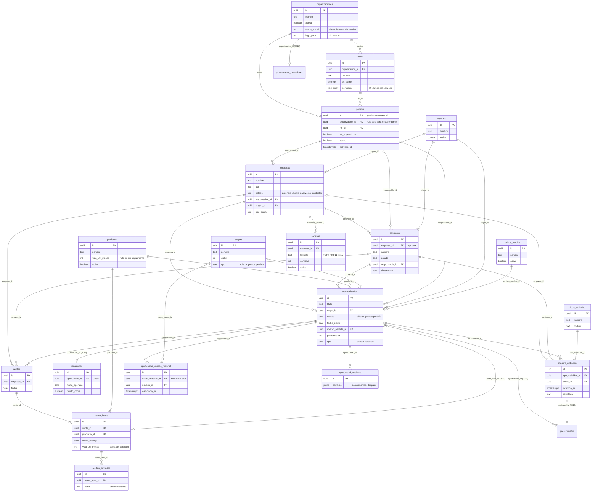

# Modelo de datos

Esquema `public` de Postgres (Supabase) tal como queda después de aplicar las migraciones `0001` a `0007`
(más la `0008` a la `0012`, que están en el repositorio y **se aplican a mano**; la `0011` agrega `canchas`,
`licitaciones` y `oportunidades.venta_item_id`, ver [Rubro](#rubro-0011-f4); la `0012` agrega `presupuestos` y
`presupuesto_contadores`, ver [Presupuestos](#presupuestos-0012-f6)).
La fuente de verdad son los archivos de `supabase/migrations/`; este documento los resume.

**Estado de cada parte.** Las tablas, columnas y reglas de este documento existen en la base de producción
(la `0007` se aplicó el 2026-10-04). Las que la interfaz todavía no usa están marcadas como
**sin interfaz**. El archivo de tipos `src/lib/supabase/types.ts` **no se regeneró después de la 0007** y
refleja el esquema anterior (13 tablas): hay que regenerarlo antes de construir las pantallas nuevas.

Contenido: [Diagrama](#diagrama-entidad-relación) · [Convenciones](#convenciones-que-aplican-a-todo) ·
[Referencia por tabla](#referencia-por-tabla) · [Vista](#vista-alertas_vida_util) ·
[Funciones y triggers](#funciones-y-triggers) · [Storage](#storage-bucket-logos)

---

## Diagrama entidad-relación

Se muestran las columnas clave. Todas las tablas, salvo `organizaciones` y `envios_auth`, llevan además
`organizacion_id` (en `perfiles` es nulo solo para el superadmin), con clave foránea compuesta
`(organizacion_id, id)` hacia sus referenciadas (ver [convenciones](#convenciones-que-aplican-a-todo)).

La tabla `envios_auth` (registro de mails de cuenta, para el límite de envíos) no se dibuja: no se
relaciona con ninguna otra.

---

## Convenciones que aplican a todo

| Convención | Detalle |
|---|---|
| Organización | Cada tabla de datos tiene `organizacion_id uuid not null default org_actual()`. El `WITH CHECK` de la política rechaza cualquier valor que no sea la organización propia |
| FK compuestas | Toda referencia entre tablas de datos (salvo las que apuntan a `perfiles`: responsable, autor, usuario) es `(organizacion_id, x_id) → tabla (organizacion_id, id)`, con una restricción `unique (organizacion_id, id)` en el lado referenciado. La base impide así cruzar datos entre clientes |
| Unicidades por cliente | `productos (organizacion_id, nombre)`, `etapas (organizacion_id, orden)`, `roles (organizacion_id, nombre)`, `origenes`, `motivos_perdida` y `tipos_actividad` por `(organizacion_id, nombre)` |
| Baja lógica | `productos.activo`, catálogos con `activo`, empresas y contactos con `estado = 'inactivo'`, usuarios con `perfiles.activo`, organizaciones con `activa`. Las oportunidades no se borran (sin política de borrado) |
| Registros inmutables | `bitacora_entradas`, `alertas_enviadas`, `oportunidad_etapas_historial` y `oportunidad_auditoria` no tienen política de update ni delete |
| Nombres | Tablas, columnas, rutas y textos en español, consistente con el dominio |
| Identificadores | `uuid` generados con `gen_random_uuid()`; `envios_auth.id` es `bigint generated always as identity` |
| RLS | Habilitado en las 18 tablas. `envios_auth` no tiene políticas: solo la toca el servidor con `service_role` |
| Evaluación de funciones en RLS | Las políticas usan `(select public.org_actual())` y `(select public.tiene_permiso(...))` para que Postgres evalúe la función una vez por consulta y no una vez por fila |

**Cómo se lee "RLS" en las tablas de abajo.** "Cartera" significa: `clientes.ver_todos` o ser el responsable
de la fila (para lo que cuelga de una empresa, poder ver la empresa). "Org" significa
`organizacion_id = org_actual()`.

---

## Referencia por tabla

### Núcleo de plataforma

#### `organizaciones`

| | |
|---|---|
| Propósito | Un cliente del CRM (tenant). Guarda también los datos fiscales del proveedor para presupuestos |
| Columnas clave | `id`, `nombre`, `activa`, `created_at`. Desde la 0007 (**sin interfaz**): `razon_social`, `cuit`, `condicion_iva` (`responsable_inscripto`, `monotributo`, `exento`), `direccion`, `telefono`, `email`, `sitio_web`, `logo_path`, `presupuesto_validez_dias` (por defecto 15, mayor que 0), `presupuesto_condiciones` |
| Claves foráneas | Ninguna |
| RLS | Ver: la propia o superadmin. Superadmin: todo. Actualizar: `configuracion.gestionar` sobre la propia. El trigger `organizaciones_proteger_plataforma` impide que un usuario final cambie `id`, `nombre`, `activa` o `created_at` |
| Notas | Un trigger `organizaciones_inicial` crea al insertar: 4 roles, 6 etapas del rubro y los catálogos. La organización con id fijo `00000000-0000-0000-0000-000000000001` ("Tuco & Nito (demo)") es de la migración `0004` |

#### `perfiles`

| | |
|---|---|
| Propósito | Espejo liviano de `auth.users` y vínculo de cada usuario con su organización y su rol |
| Columnas clave | `id` (= `auth.users.id`), `nombre`, `email`, `organizacion_id`, `rol_id`, `es_superadmin`, `activo`, `activado_at` |
| Claves foráneas | `id → auth.users` (cascade); `organizacion_id → organizaciones` (cascade); `(organizacion_id, rol_id) → roles` (restrict) |
| Restricciones | `perfiles_org_o_superadmin`: sin organización solo si es superadmin |
| RLS | Ver: uno mismo, los de la organización o el superadmin. **Sin políticas de escritura**: ni el rol ni la organización los cambia un usuario; lo hace el servidor con `service_role` |
| Notas | `activado_at` nulo significa invitación pendiente. Se completa solo por el trigger `on_auth_user_created` (`handle_new_user`), que lee la organización y el rol de `raw_app_meta_data` |

#### `roles`

| | |
|---|---|
| Propósito | Conjunto de permisos con nombre, propio de cada organización |
| Columnas clave | `id`, `organizacion_id`, `nombre`, `descripcion`, `es_admin`, `permisos text[]` |
| Restricciones | `roles_permisos_validos`: `permisos` solo puede contener las 19 claves del catálogo. `unique (organizacion_id, nombre)` |
| RLS | Ver: la organización o el superadmin. Crear, editar, borrar: `usuarios.gestionar` y `not es_admin` (el rol Administrador no se toca) |
| Notas | El catálogo de claves está en `src/lib/permisos.ts` y debe coincidir con el CHECK; lo verifica `permisos.check.ts` |

#### `envios_auth`

| | |
|---|---|
| Propósito | Registro de los mails de cuenta enviados, para limitar la frecuencia |
| Columnas clave | `id`, `email`, `tipo` (`activacion`, `recuperacion`), `created_at` |
| RLS | Habilitado, sin políticas: solo `service_role`. `registrar_envio_auth()` está revocada a `public`, `anon` y `authenticated` |

### Clientes

#### `empresas`

| | |
|---|---|
| Propósito | Clubes, complejos, escuelas, colegios, predios municipales |
| Columnas de la 1ª versión | `nombre`, `cuit`, `telefono`, `email`, `direccion`, `notas` |
| Columnas de la 0007 (**sin interfaz**) | `estado` (`potencial`, `cliente`, `inactivo`, `no_contactar`; por defecto `potencial`), `responsable_id`, `origen_id`, `tipo_cliente` (`club`, `complejo_f5`, `escuela_futbol`, `predio_municipal`, `colegio`, `otro`), `sitio_web` |
| Claves foráneas | `responsable_id → perfiles` (set null); `(organizacion_id, origen_id) → origenes` |
| RLS | Ver, editar, borrar: Org y `clientes.ver`/`clientes.editar` y Cartera. Crear: Org y `clientes.editar` |
| Notas | Trigger `validar_responsable('clientes.asignar')`. Sin política de borrar desde la `0008` (baja lógica por `estado`) |

#### `contactos`

| | |
|---|---|
| Propósito | Personas; pueden existir sin empresa (cliente individual) |
| Columnas | `empresa_id` (opcional), `nombre`, `apellido`, `email`, `telefono`, `cargo`, `notas`. Desde la 0007 (**sin interfaz**): `estado`, `responsable_id`, `origen_id`, `documento` |
| Claves foráneas | `(organizacion_id, empresa_id) → empresas` (set null en `empresa_id`); `responsable_id → perfiles` (set null); `(organizacion_id, origen_id) → origenes` |
| RLS | Igual que `empresas`, y además se ve si la empresa del contacto es visible |
| Notas | Un contacto con actividades no se puede borrar (la FK desde `bitacora_entradas` es `no action`) |

### Catálogo y comercial

#### `productos`

| | |
|---|---|
| Propósito | Catálogo de equipamiento con su vida útil |
| Columnas | `nombre`, `descripcion`, `marca`, `categoria`, `precio numeric(12,2)`, `activo`, `vida_util_meses` (mayor que 0 o nulo = sin seguimiento de recambio) |
| RLS | Ver: `productos.ver`. Crear, editar, borrar: `productos.editar` (siempre dentro de la organización) |
| Notas | Se da de baja con `activo = false`. `venta_items.producto_id` es `restrict` |

#### `etapas`

| | |
|---|---|
| Propósito | Etapas del embudo de cada organización |
| Columnas | `nombre`, `orden`, `color`, `tipo` (`abierta`, `ganada`, `perdida`; 0007) |
| RLS | Ver: cualquier usuario de la organización. Crear, editar, borrar: `configuracion.gestionar` (interfaz en `/configuracion`; la etapa que alguna vez tuvo oportunidades no se puede borrar, la frenan las FK) |
| Notas | El `tipo` define el `estado` de las oportunidades que están en la etapa. El trigger `etapas_validar_tipo` impide cambiar el tipo de una etapa con oportunidades. Embudo por defecto: Consulta recibida, Relevamiento de cancha, Presupuesto enviado, Negociación, Entregado (ganada), Perdida |

#### `oportunidades`

| | |
|---|---|
| Propósito | Una negociación comercial concreta |
| Columnas de la 1ª versión | `titulo`, `empresa_id`, `contacto_id`, `producto_id`, `responsable_id`, `etapa_id`, `monto`, `notas`, `created_at`, `updated_at` |
| Columnas de la 0007 (interfaz desde F2) | `estado` (`abierta`, `ganada`, `perdida`), `fecha_estimada_cierre`, `fecha_cierre`, `origen_id`, `motivo_perdida_id`, `probabilidad` (0 a 100), `tipo` (`directa`, `licitacion`) |
| Claves foráneas | Compuestas a `empresas`, `contactos`, `productos` (las tres con set null de su columna), `etapas`, `origenes`, `motivos_perdida`; `responsable_id → perfiles` (set null) |
| Restricción | `oportunidades_estado_coherente`: abierta sin fecha ni motivo; ganada con fecha y sin motivo; perdida con ambos |
| RLS | Ver, editar: `oportunidades.ver`/`oportunidades.editar` y Cartera. Crear: `oportunidades.editar`. **Sin política de borrar** |
| Triggers | `oportunidades_reglas`, `oportunidades_requiere_cliente` (0009), `oportunidades_validar_responsable`, `set_oportunidades_updated_at` (antes); `oportunidades_registrar_etapa`, `oportunidades_auditar_cerrada` (después) |

#### `ventas` y `venta_items`

| | |
|---|---|
| Propósito | El hecho consumado: qué se vendió y cuándo se entregó. Es distinto de la oportunidad (el embudo) |
| `ventas` | `empresa_id` (obligatoria, cascade), `contacto_id`, `oportunidad_id` (ambos set null), `fecha`, `comprobante`, `notas` |
| `venta_items` | `venta_id` (cascade), `producto_id` (**restrict**), `cantidad` (mayor que 0), `precio_unitario`, `fecha_entrega`, `vida_util_meses` |
| RLS | Ver y editar según `ventas.ver`/`ventas.editar`; Cartera por la empresa (los ítems, por su venta) |
| Notas | El trigger `set_venta_items_defaults` copia `vida_util_meses` del producto y toma `fecha_entrega` de la venta cuando vienen vacíos. La copia es un snapshot a propósito |

#### `alertas_enviadas`

| | |
|---|---|
| Propósito | Registro de cada aviso de recambio enviado. Solo se guarda lo enviado; las pendientes se calculan |
| Columnas | `venta_item_id` (cascade), `canal` (`email`, `whatsapp`), `destinatario`, `mensaje`, `enviado_por`, `enviado_at` |
| RLS | Ver: `alertas.ver` y Cartera. Crear: `alertas.enviar`. Sin update ni delete |

### Rubro (0011, F4)

Las cargan los proveedores sobre sus clientes. Se aplican a mano; mientras falten, la aplicación esconde las
secciones (ver [reglas, sección 11](./reglas-de-negocio.md#11-reglas-del-rubro-f4)).

#### `canchas`

| | |
|---|---|
| Propósito | Ficha de canchas de un cliente. Alimenta el equipamiento sugerido |
| Columnas | `empresa_id` (obligatoria, FK compuesta, cascade), `nombre`, `formato` (`F5`, `F7`, `F9`, `F11`, `futsal`), `superficie` (nula, o sintetico/natural/cemento/parquet), `cantidad` (mayor o igual a 1), `iluminacion`, `notas`, `activa`, `created_at`, `updated_at` |
| RLS | Ver: `clientes.ver`; crear y editar: `clientes.editar`; cartera por la empresa. **Sin política de borrar**: baja lógica con `activa = false` |

#### `licitaciones`

| | |
|---|---|
| Propósito | Datos de una oportunidad de tipo licitación |
| Columnas | `oportunidad_id` (**único**, FK compuesta, cascade), `expediente`, `organismo`, `fecha_apertura` (obligatoria), `monto_oficial` (mayor o igual a 0), `garantia` (texto libre), `notas`, `created_at`, `updated_at` |
| RLS | Ver: `oportunidades.ver`; crear y editar: `oportunidades.editar`; cartera por la oportunidad. Sin política de borrar |
| Regla | El trigger `oportunidades_licitacion_regla` (sobre `oportunidades`) impide pasar a ganada antes de `fecha_apertura` o sin esta fila |

#### `oportunidades.venta_item_id`

Columna nula, FK compuesta `(organizacion_id, venta_item_id)` a `venta_items`, `on delete set null`, índice parcial y un
**índice único parcial** `oportunidades_venta_item_abierta_key` (`organizacion_id, venta_item_id` donde `estado = 'abierta'`): un equipo
tiene a lo sumo una oportunidad de recambio abierta.
Es el equipo entregado del que sale una oportunidad de recambio.

### Presupuestos (0012, F6)

Se aplican a mano; mientras falten, `/oportunidades/[id]/presupuesto` arma e imprime el presupuesto como «Borrador» (ver
[reglas, sección 13](./reglas-de-negocio.md#13-presupuesto-imprimible-f6)).

#### `presupuestos`

| | |
|---|---|
| Propósito | Cada presupuesto emitido desde una oportunidad: numerado, con sus líneas y lo que se imprimió. Documento emitido: **no se borra ni se modifica** |
| Columnas | `oportunidad_id` (obligatoria, FK compuesta a `oportunidades`, sin `on delete`), `numero` (correlativo por organización, **lo asigna el trigger**; `default 0` y `check (numero > 0)`: el trigger pisa el 0 y cualquier valor del cliente), `fecha` (emisión; **la pone la base**, hoy en Argentina), `validez_dias` (1 a 365), `condiciones` (hasta 2000 caracteres), `lineas` (`jsonb`, arreglo de hasta 200: `{ producto_id?, descripcion, cantidad, precio_unitario, descuento_pct }`), `notas`, `total` (mayor o igual a 0; con IVA si el proveedor es Responsable Inscripto), `creado_por` (el trigger lo fuerza a `auth.uid()` cuando hay usuario), `condicion_iva` y `emisor` (**foto del emisor al emitir**: la condición frente al IVA, y razón social, CUIT, dirección, teléfono, mail y web en un `jsonb` objeto; **no el logo**), `created_at`, `actividad_id` (la actividad «Envío de propuesta» registrada al imprimir; FK compuesta a `bitacora_entradas`, `on delete set null`) |
| Restricciones | `UNIQUE (organizacion_id, numero)`, `UNIQUE (organizacion_id, id)` |
| RLS | Ver: `oportunidades.ver`; crear y editar: `oportunidades.editar`; cartera por la oportunidad (salvo `clientes.ver_todos`). **Sin política de borrar** |
| Reglas | `presupuestos_numero` (antes de insertar) asigna el número, fuerza `creado_por` y deja `actividad_id` en nulo; `presupuestos_proteger` (antes de actualizar) rechaza cualquier cambio salvo completar `actividad_id`, y una sola vez (`23514`); la única excepción es soltar el vínculo cuando la actividad ya no existe (el `on delete set null` de la FK) |

`lineas` y `total` los arma la aplicación con `src/lib/presupuesto.ts`; la base solo exige que `lineas` sea un arreglo
de hasta 200 elementos y que `total` no sea negativo (no recalcula el total: es la copia de lo que se imprimió).

#### `presupuesto_contadores`

| | |
|---|---|
| Propósito | Último número asignado por organización |
| Columnas | `organizacion_id` (PK, cascade), `ultimo` |
| RLS | Prendida **sin políticas** y con los privilegios de `anon` y `authenticated` revocados: no se lee ni se escribe desde la API. Solo la toca el trigger, que es `SECURITY DEFINER` |

La 0012 también agrega `bitacora_entradas_org_id_key` (`UNIQUE (organizacion_id, id)`) en `bitacora_entradas`, que la FK
compuesta de `actividad_id` necesita como destino.

### Actividad e historial

#### `bitacora_entradas` (las "actividades")

| | |
|---|---|
| Propósito | Interacciones comerciales ya ocurridas. Es un log: se agrega, no se corrige |
| Columnas de la 1ª versión | `empresa_id`, `contacto_id`, `tipo` (texto), `titulo`, `detalle`, `autor_id`, `ocurrido_en` |
| Columnas de la 0007 | `tipo_actividad_id` (obligatoria), `oportunidad_id`, `resultado`; `empresa_id` pasa a ser opcional |
| Restricción | `bitacora_entradas_empresa_o_contacto`: al menos una de las dos |
| Claves foráneas | `(organizacion_id, empresa_id)` cascade; `contacto_id` **no action**; `oportunidad_id` set null; `tipo_actividad_id` |
| RLS | Ver: `bitacora.ver` y (todo, o empresa, contacto u oportunidad visibles). Crear: `bitacora.escribir` y cada referencia visible y coherente entre sí. Sin update ni delete |
| Notas | La columna `tipo` es la heredada de la primera versión (su CHECK se eliminó); el trigger `bitacora_defaults` la mantiene sincronizada con el tipo de catálogo y fuerza `autor_id = auth.uid()` |

#### `oportunidad_etapas_historial`

| | |
|---|---|
| Propósito | Cada cambio de etapa: de dónde, a dónde, cuándo, quién y por qué. El alta registra una fila con `etapa_anterior_id` nulo |
| Columnas | `oportunidad_id`, `etapa_anterior_id`, `etapa_nueva_id`, `usuario_id`, `observacion`, `cambiado_en` |
| Claves foráneas | A `oportunidades` y `etapas` con **no action** (una oportunidad con historial no se borra) |
| RLS | Ver: `oportunidades.ver` y poder ver la oportunidad. Sin políticas de escritura; la escribe el trigger `oportunidad_registrar_etapa` (`SECURITY DEFINER`) |
| Estado | Se escribe en cada alta y cambio de etapa. Se lee en el detalle de la oportunidad (F2) |

#### `oportunidad_auditoria`

| | |
|---|---|
| Propósito | Toda modificación de una oportunidad que ya estaba cerrada: `cambios = {campo: {antes, despues}}` |
| Columnas | `oportunidad_id`, `usuario_id`, `cambios jsonb`, `cambiado_en` |
| RLS | Igual que el historial. La escribe `oportunidad_auditar_cerrada` |
| Estado | Se lee en el detalle de la oportunidad, sección "Cambios después del cierre" (F2) |

### Catálogos configurables (0007, **sin interfaz**)

| Tabla | Propósito | Columnas | Valores iniciales |
|---|---|---|---|
| `origenes` | De dónde vino el cliente u oportunidad | `nombre`, `activo`, `orden` | Recambio por vida útil, Referido de otro club, Licitación municipal, Redes sociales, Web, Visita a predio, Torneo / feria |
| `motivos_perdida` | Por qué se perdió una oportunidad | `nombre`, `activo`, `orden` | Precio, Eligió otro proveedor, Sin presupuesto del club, Licitación adjudicada a otro, Plazo de entrega, Pospone a la próxima temporada, Dato histórico sin motivo |
| `tipos_actividad` | Tipos de actividad | `nombre`, `codigo`, `activo`, `orden` | Llamada, Correo electrónico, Mensaje, Reunión presencial, Reunión virtual, Demostración, Envío de propuesta, Visita a cancha, Entrega de equipamiento, Reclamo, Nota interna, Otro |

RLS de los tres: ver, con la organización y alguno de los permisos de uso (`origenes`: `clientes.ver` u
`oportunidades.ver`; `motivos_perdida`: `oportunidades.ver`; `tipos_actividad`: `bitacora.ver`) o
`configuracion.gestionar`; crear, editar y borrar: `configuracion.gestionar`. Se dan de baja con
`activo = false` porque lo ya registrado los sigue referenciando (FK sin cascada). `tipos_actividad.codigo`
es la clave estable de los tipos de sistema y mapea los valores viejos de `bitacora_entradas.tipo`.

---

## Vista `alertas_vida_util`

| | |
|---|---|
| Propósito | Equipos entregados que vencieron o vencen en los próximos 60 días. Se calcula en vivo; no hay cron |
| Definición | `venta_items` ⨝ `ventas` ⨝ `empresas` ⨝ `productos`, con `contactos` y el último envío por ítem (`left join lateral` sobre `alertas_enviadas`) |
| Filtro | `vida_util_meses` y `fecha_entrega` no nulos, y `fecha_entrega + vida_util_meses meses <= current_date + 60` |
| Columnas calculadas | `vence_el`, `dias_restantes`, `estado` (`vencido` si `vence_el <= hoy`, si no `por_vencer`), `ultimo_envio`, `ultimo_canal` |
| Seguridad | `security_invoker = on`: respeta la RLS de quien consulta. Como hace join con `empresas`, un Vendedor solo ve las de su cartera sin tocarla |

---

## Funciones y triggers

| Función | Tipo | Para qué |
|---|---|---|
| `org_actual()`, `es_superadmin()`, `tiene_permiso(p)` | `SECURITY DEFINER`, `stable` | Contexto de las políticas RLS |
| `handle_new_user()` | Trigger sobre `auth.users` | Crea el `perfil` leyendo organización y rol de `raw_app_meta_data` |
| `organizacion_inicial()` | Trigger sobre `organizaciones` | Roles, embudo y catálogos de una organización nueva |
| `crear_roles_iniciales(uuid)`, `crear_catalogos_iniciales(uuid)` | Revocadas a usuarios finales | Siembra de roles y catálogos |
| `registrar_envio_auth(email, tipo)` | Revocada a usuarios finales | Límite de mails de cuenta con lock |
| `venta_items_defaults()` | Trigger | Snapshot de vida útil y fecha de entrega |
| `validar_responsable()` | Trigger (empresas, contactos, oportunidades) | Asignación y mismo cliente |
| `oportunidad_reglas()` | Trigger antes de insertar o actualizar | Estado desde la etapa, cierre, reapertura. Desde la 0009: fecha de cierre no futura y por defecto en fecha de Argentina |
| `oportunidad_requiere_cliente()` | Trigger antes de insertar o actualizar `empresa_id`/`contacto_id` (0009) | Empresa o contacto obligatorio, solo con usuario |
| `oportunidad_registrar_etapa()` | Trigger después, `SECURITY DEFINER` | Historial de etapas |
| `oportunidad_auditar_cerrada()` | Trigger después, `SECURITY DEFINER` | Auditoría de cerradas |
| `etapas_validar_tipo()` | Trigger, `SECURITY DEFINER` | No cambiar el tipo de una etapa con oportunidades |
| `bitacora_defaults()` | Trigger | Autor y tipo de catálogo |
| `organizaciones_proteger_plataforma()` | Trigger | Nombre y estado de la organización, solo de la plataforma |
| `oportunidad_licitacion_regla()` | Trigger antes de insertar o actualizar `etapa_id`/`estado`/`tipo` de `oportunidades` (0011) | Una licitación no pasa a ganada antes de su apertura (fecha de Argentina) ni sin datos |
| `presupuesto_asignar_numero()` | Trigger antes de insertar en `presupuestos` (0012), `SECURITY DEFINER` | Número correlativo por organización con `insert ... on conflict do update ... returning` sobre `presupuesto_contadores` (serializa altas simultáneas; ignora el número del cliente) |
| `presupuesto_proteger()` | Trigger antes de actualizar `presupuestos` (0012), `SECURITY DEFINER` | Un presupuesto emitido no se modifica; solo se completa `actividad_id`, una vez (o se suelta si borran la actividad) |
| `set_updated_at()` | Trigger | `updated_at` de oportunidades, canchas y licitaciones |
| `cambiar_etapa(op, etapa, observacion, motivo, fecha)` | RPC, `SECURITY INVOKER` | Cambia de etapa con observación, motivo y fecha. Ejecutable por `authenticated` y `service_role` |

Detalle de cada regla en [reglas de negocio](./reglas-de-negocio.md).

## Storage: bucket `logos`

Privado (`public = false`), solo `image/png`, `image/jpeg` e `image/webp`, hasta 1.048.576 bytes. Ruta
`{organizacion_id}/logo.{png|jpg|jpeg|webp}`. Cuatro políticas sobre `storage.objects`: ver (cualquiera de
la organización) y subir, cambiar y borrar (`configuracion.gestionar`, solo en la carpeta de la propia
organización). SVG queda afuera a propósito. **Sin interfaz** todavía (F1).
